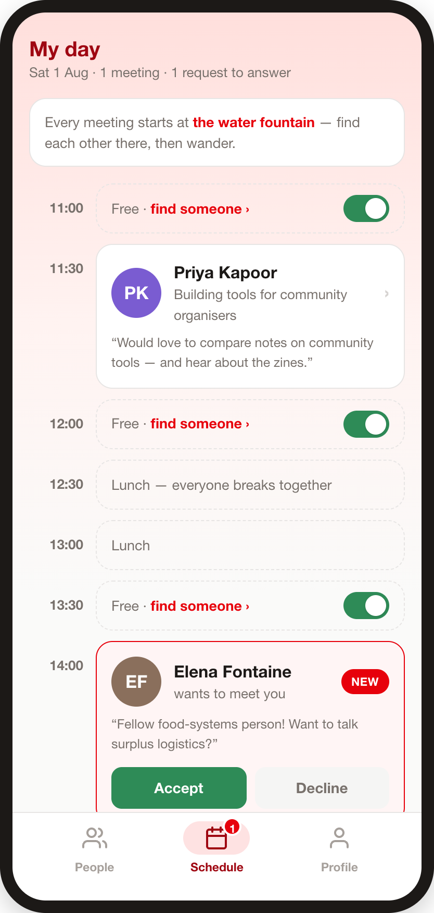
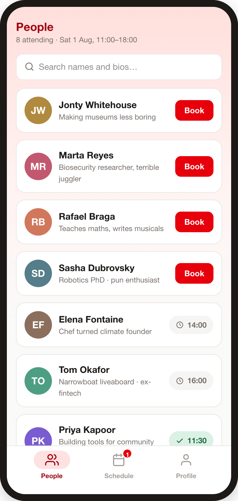
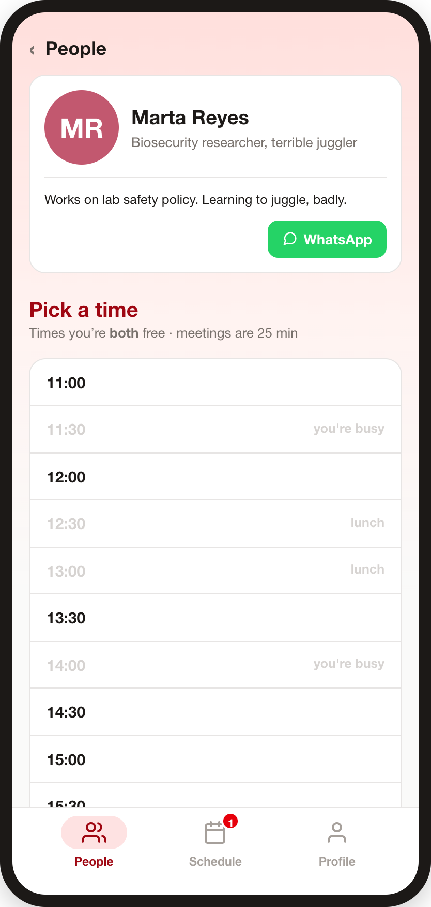

# adamcon

**Live at https://adamcon.home.adamjones.me** (homelab k3s; image
`ghcr.io/domdomegg/adamcon` built by CI on every push to master — restart the
`adamcon` service via the homelab restart workflow to pick up a new image).

The AdamCon '26 one-to-ones app: profiles → directory → request a 25-minute
meeting → accept/decline → your day's schedule. All meetings start at the water
fountain.

	
	
	

Built from [typescript-webapp-template](https://github.com/domdomegg/typescript-webapp-template)
with API routes enabled (Next.js pages router + better-sqlite3).

## Design

- **The day**: Sat 1 Aug 2026, 11:00–18:00, ~30 attendees. 14 half-hour rows;
  lunch (12:30–13:30) is fixed for everyone, leaving 12 bookable slots.
  Meetings are 25 minutes — the spare 5 is walking time to/from the one
  rendezvous point, the water fountain.
- **Booking rules**: a request holds the slot for both parties until answered
  or withdrawn (no auto-expiry); accepting removes the slot from both
  people's availability; either party can cancel (both notified, slot
  reopens); max one live meeting or request per pair. Blocking a booked slot
  is impossible by construction — a booked row *is* the meeting.
- **Emails only when the recipient must act or their day changed**: invite,
  sign-in link, incoming request, cancellation. Accepts, declines and
  withdrawals are silent — the schedule is the confirmation.
- **Deliberately not built**: tags, filters, chat (WhatsApp deep links cover
  it), a feed, settings, self-serve signup (accounts exist only via the
  Airtable import), realtime (60-second poll), native apps (a service worker
  keeps it fast on flaky towpath signal).

## Local development

1. `npm install`
2. `npm start` — dev server (check the port it prints; sign-in links assume
   `APP_ORIGIN`, default `http://localhost:3000`), plus
   [aws-ses-v2-local](https://github.com/domdomegg/aws-ses-v2-local) so all
   emails (magic links included) land in a local inbox at
   http://localhost:8005 — the production SES code path, pointed at the
   emulator.

On first run against an empty database it seeds the mockup cast, printing
each person's email and a sign-in link. Sign in by opening one of those
links, or via the login page with a seeded email — the emailed link lands in
the local inbox.

## Configuration (env vars)

| Var | What |
|---|---|
| `APP_ORIGIN` | Public origin used in emailed links, e.g. `https://adamcon.adamjones.me` |
| `EMAIL_FROM` | From address for SES sends (default credential chain — in-cluster this is workload identity federation, see `infra/README.md`). `npm start` sets a dev value |
| `SES_ENDPOINT` | Point SES at a local emulator (`npm start` sets it to aws-ses-v2-local). Unset = real SES |
| `DATA_DIR` | Where `adamcon.db` lives (default `./data`) |
| `AIRTABLE_API_KEY` | PAT for the import script (data.records read/write on the AdamCon base) |

## Onboarding attendees

`npm run import` — idempotently imports the Airtable **2026 People** table
(match on email), emails each new person a magic-link invite, and ticks the
invited checkbox back in Airtable. Rerun any time for late signups.

## Before the event

- [ ] Morning-of schedule email (small script over `meetings`, or send manually)
